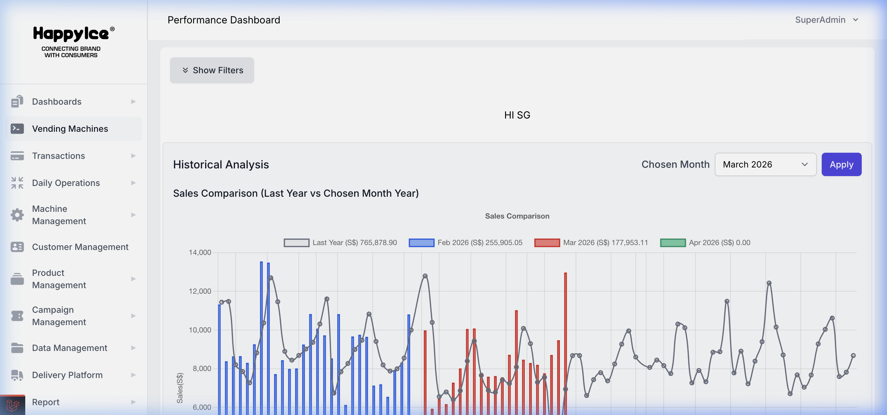
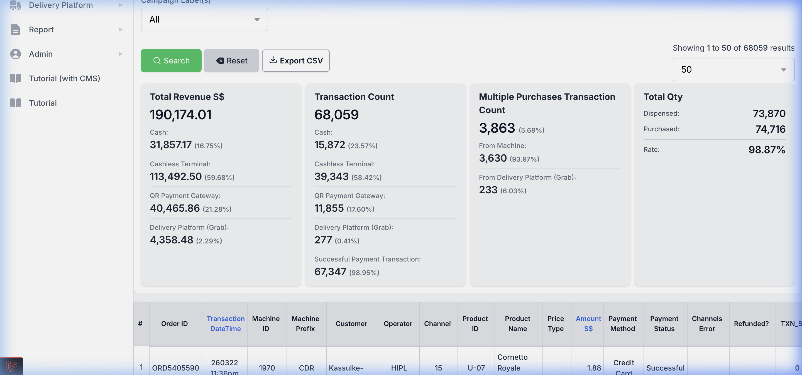
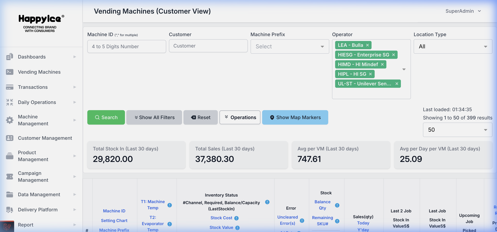
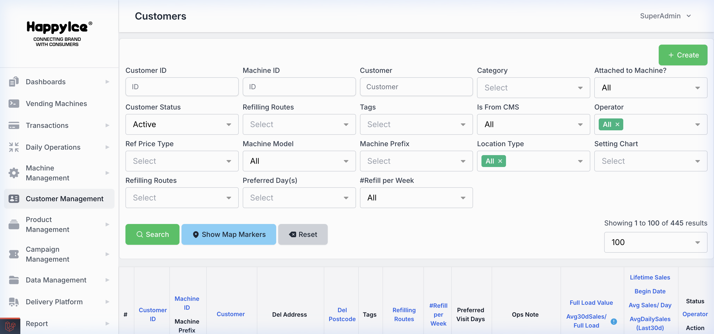
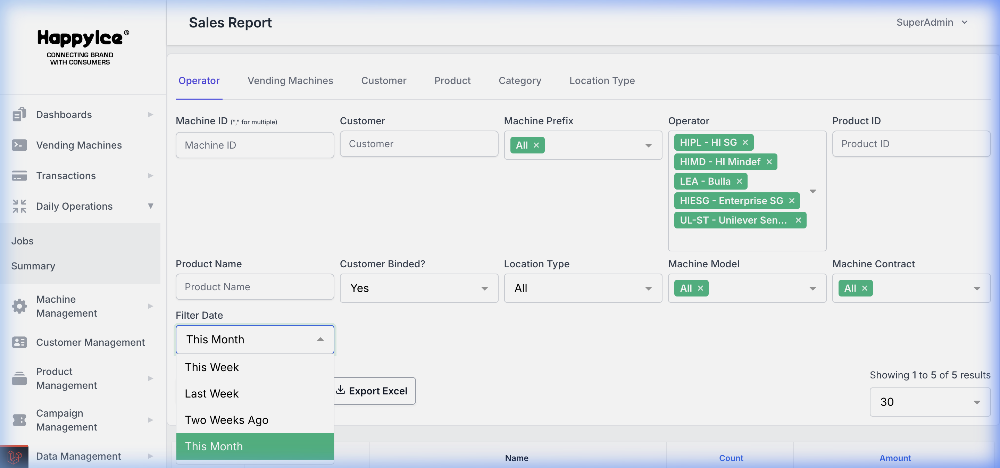
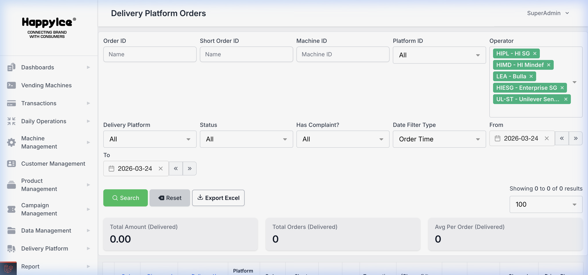
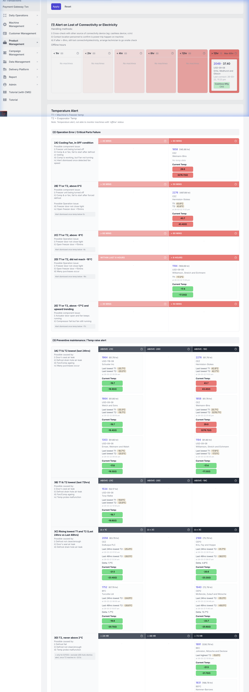
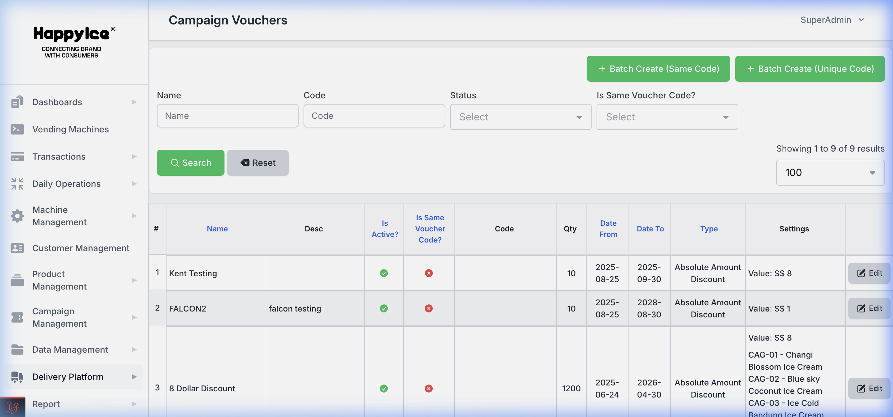
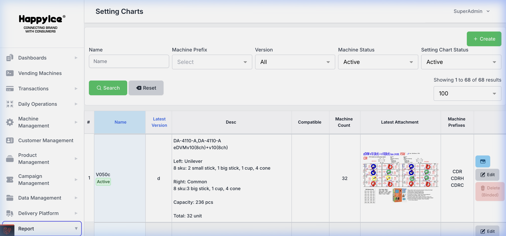
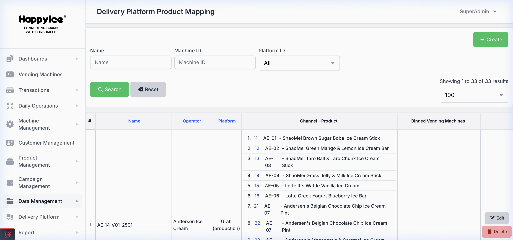

# Project Portfolio Showcase
## Happy Ice Vending Management System (MARK1)

---

### 1. 📊 Performance Analytics Dashboard

**Module Overview**: 
The Performance Dashboard provides real-time business intelligence for vending machine fleet management. It features interactive charts for monthly sales comparisons (Last Year vs. Current Month), daily revenue tracking, and historical trend analysis.

**Technical Implementation**: 
- **Fuzzed Financial Data**: To ensure data confidentiality for demonstrations, all revenue figures have been automatically fuzzed using a +/- 20% randomization algorithm, while maintaining actual business distribution patterns.
- **High-Performance Rendering**: Optimized front-end components for smooth data visualization across thousands of machine records.

---

### 2. 📑 Sales & Transaction Management

**Module Overview**:
A robust transaction engine capable of logging and viewing millions of records. This screenshot showcases the detailed transaction log with granular search and filtering capabilities.

**Key Technical Details**:
- **Scale**: The system actively manages **4.4 Million** records in the transaction table.
- **Data Protection**: All sensitive identifiers (Order IDs, Machine codes) are systemically anonymized to protect customer privacy.
- **Comprehensive Tracking**: Captures complete transaction lifecycles, including payment methods (Cash, Terminal, QR), dispense status, and product-specific data.

---

### 3. 🤖 Asset & Inventory Management

**Module Overview**:
The Vending Machine Management interface provides deep insights into the operational health and inventory status of the entire fleet.

**Features Displayed**:
- **Custom Tracking**: Machine IDs are synchronized with a custom 1000+ base incrementing logic for clean, professional data representation.
- **Operational Metrics**: Real-time monitoring of stock levels (Stock In vs. Sales), internal temperatures (Evaporator/Machine), and error codes.
- **Operator Linkage**: Dynamic associations between machines, operators (e.g., HIPL), and customer prefixes.

---

### 4. 👥 Customer Management & CRM

**Module Overview**:
A tailored CRM system for managing relationships with diverse business partners and machine owners.

**Implementation Highlights**:
- **Full Anonymization**: All customer names, addresses, and contacts are replaced with generic profiles for data security during public demonstrations.
- **Lifecycle Sales Analytics**: Each customer profile dynamically tracks lifetime sales metrics and average performance per machine.

---

### 5. 📉 Operator Performance Reports

**Module Overview**: 
Structured reporting tools providing periodic sales breakdowns by operator and region. This module is essential for revenue sharing and performance auditing across different business units.

---

### 6. 🛵 Delivery Platform Integration (Grab)

**Module Overview**: 
A seamless integration with major delivery platforms like **Grab**, allowing for centralized order management. This feature enables vending machines to act as local distribution hubs for online delivery.

**Technical Highlights**: 
- **Real-time Order Sync**: Automated polling and webhook-based synchronization of incoming delivery orders with the vending machine's inventory system.
- **Status Lifecycle Tracking**: Monitors full delivery status from "Order Received" to "Picked Up" and "Delivered".

---

### 7. 🏥 Machine Dashboard Health (Deep Telemetry)

**Module Overview**: 
A high-level health monitoring center and tiered alerting engine that tracks critical hardware telemetry in real-time.

**Advanced Operational Intelligence**: 
- **Predictive Health Cohorts**: Alerts categorized by downtime duration and error severity (Offline, Lost Connectivity, or Power Trip).
- **Incident Management Suite**: Built-in troubleshooting guides (2A through 2E) for field technicians to address cooling failures, temperature breaches, and operational faults.
- **T1/T2 Telemetry Integration**: Real-time status tracking of Freezer (T1) and Evaporator (T2) sensors for automated food safety audit logs.

---

### 8. 🎟️ Advanced Campaign & Voucher Engine

**Module Overview**: 
A robust promotional engine that allows for the creation, distribution, and monitoring of discount campaigns.

**Key Technical Features**: 
- **Batch Generation**: Capability to generate thousands of unique or shared voucher codes with high concurrency.
- **Rules Engine**: Automated validation of absolute vs. percentage discounts, date-range constraints, and active status toggles.

---

### 9. ⚙️ VMC Setting Charts (Hardware Layout)

**Module Overview**: 
A highly specialized module mapping physical vending machine hardware layouts (VMC) to software-defined product channels.

**System Complexity**: 
- **Hardware-Software Mapping**: Visual reference diagrams showing channel/motor layouts (e.g., DA-4110-A, eDVM v10) synchronized with internal database mappings.
- **Fleet-wide Consistency**: Ensures that product dispenses from the correct motor channel across 500+ heterogeneous machine configurations.

---

### 10. 🚚 Delivery Platform Product Mapping (O2O)

**Module Overview**: 
The Online-to-Offline (O2O) integration bridge that links third-party delivery partners with physical machine channels.

**Integration Value**: 
- **Universal SKU Linkage**: Maps Platform Item IDs (e.g., Grab Mart) to physical machine channels and internal SKUs.
- **Automated Inventory Sync**: Ensures that orders placed via Grab are only accepted if the machine's internal hardware reports available stock.

---

### 🛠️ Technical Portfolio Highlights
*   **Enterprise Anonymization Engine**: Designed a memory-efficient PHP engine to mask 4.4M+ sensitive records while maintaining realistic data distributions for demonstration.
*   **IoT & Telemetry (T1/T2)**: Direct integration with machine control boards for real-time temperature and fan monitoring using specialized `Temp.vue` logic.
*   **O2O Platform Sync (Grab)**: Built and managed complex API mappings to bridge digital delivery orders with physical hardware inventory.
*   **Hardware-Software Liaison**: Implemented Setting Charts for visual hardware configuration management across a diverse fleet of vending machines.
*   **Performance at Scale**: Managed a database with **over 5 Million rows** using raw SQL optimization, chunking, and index-aware querying.
